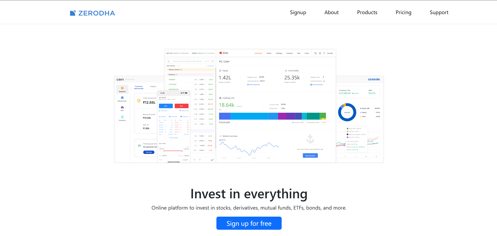
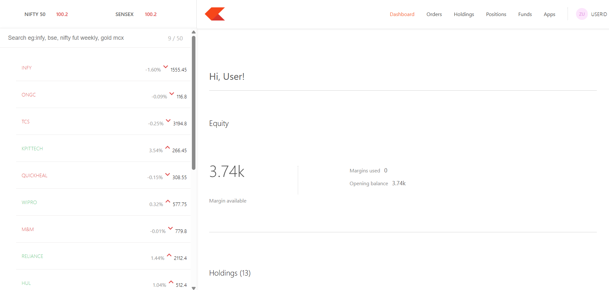
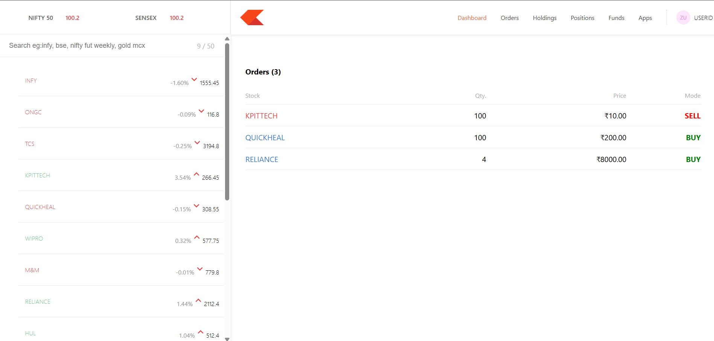

# Zerodha Clone

A full-stack stock trading dashboard inspired by Zerodha, built as a learning and portfolio project. It demonstrates authentication, protected APIs, user-specific orders, holdings/positions views, and a React-based trading dashboard.

> **Note:** This project is an educational clone and is not affiliated with or endorsed by Zerodha.

## 🚀 Features

- User signup and login
- JWT-based authentication
- Cookie-based authentication
- Protected backend routes
- User-specific order data
- Buy and sell order creation
- Orders, holdings, and positions views
- MongoDB database integration
- Express.js REST APIs
- React dashboard UI
- React Router navigation
- Axios API communication
- Material UI components
- Chart-based dashboard visualization
- Environment-variable based configuration
- Git/GitHub version control

## 🛠️ Tech Stack

### Frontend
- React.js
- React Router
- Axios
- Material UI
- Chart.js / React Chart.js 2

### Backend
- Node.js
- Express.js
- MongoDB
- Mongoose
- JWT
- bcrypt
- cookie-parser
- CORS
- dotenv

### Development
- Git
- GitHub
- VS Code
- Create React App

## 📁 Project Structure

```text
ZERODHA_CLONE/
├── backend/
│   ├── controllers/
│   ├── middleware/
│   ├── schemas/
│   └── index.js
├── dashboard/
├── frontend/
├── .gitignore
└── README.md
```

## 🔐 Authentication Flow

1. User signs up or logs in.
2. The backend validates the credentials.
3. A JWT is generated using the user's MongoDB ID.
4. The JWT is stored in an authentication cookie.
5. Protected routes verify the token through middleware.
6. Orders are associated with the authenticated user's ID.

## 📸 Screenshots

Below are screenshots of the main application screens.

### Landing Page



### Login


### Dashboard



### Orders



> Create a `screenshots` folder in the project root and place the corresponding images there. Update the filenames above if your screenshots use different names.

## ⚙️ Setup Instructions

### 1. Clone the repository

```bash
git clone https://github.com/vishal812-eng/ZERODHA_CLONE.git
cd ZERODHA_CLONE
```

### 2. Install backend dependencies

```bash
cd backend
npm install
```

### 3. Configure environment variables

Create:

```text
backend/.env
```

Example:

```env
MONGO_URL=your_mongodb_connection_string
TOKEN_KEY=your_jwt_secret
PORT=3002
```

Use the exact variable names expected by your backend code if they differ.

**Never commit `.env` files or secret keys to GitHub.**

### 4. Start the backend

From the `backend` directory:

```bash
npm start
```

If your project uses a different script, use the command defined in `backend/package.json`.

### 5. Install frontend dependencies

Open a new terminal:

```bash
cd frontend
npm install
npm start
```

### 6. Start the dashboard

Open another terminal:

```bash
cd dashboard
npm install
npm start
```

The exact local ports depend on your application configuration.

## 🔌 API Overview

| Method | Endpoint | Purpose | Protected |
|---|---|---|---|
| POST | `/signup` | Create a user account | No |
| POST | `/login` | Authenticate a user | No |
| POST | `/newOrder` | Create a buy/sell order | Yes |
| GET | `/allOrders` | Get the logged-in user's orders | Yes |

## 🧪 Testing

The project has been manually tested for:

- Signup
- Duplicate signup
- Successful login
- Wrong password
- Non-existing email
- Logout
- User-specific order isolation
- Session persistence after refresh
- Protected API access
- Buy orders
- Sell orders
- Order data accuracy
- Page navigation
- Backend and database connection

The dashboard also includes the testing tooling provided by Create React App.

Before deployment, run:

```bash
npm run build
```

inside the relevant frontend applications and make sure the production build completes successfully.

## 🌱 Future Improvements

- Real-time stock prices
- Live portfolio calculations
- Stronger order validation
- Better error handling
- Refresh-token based authentication
- Improved responsive design
- Production deployment
- Automated frontend and backend tests
- WebSocket-based real-time updates
- Improved production cookie and CORS security

## 👨‍💻 Author

**Vishal**

Built as a B.Tech CSE project and portfolio application to practice full-stack development, authentication, REST APIs, MongoDB, and React.

## 📄 Disclaimer

This is an educational project created for learning purposes. It is not a real trading platform and should not be used for financial transactions or investment decisions.
